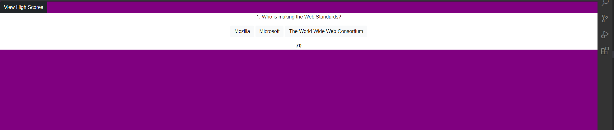

# coding-quiz

## Purpose
A 5 question quiz. The timer starts at 75 and for each question wrong you get minus 5 to the timer. The remaining time is the high score. 

## Built With
* HTML
* CSS/ Bootstrap
* Javascript

## Website
https://rkurian97.github.io/coding-quiz/

##

## Contribution
Made by Rohith Kurian. 